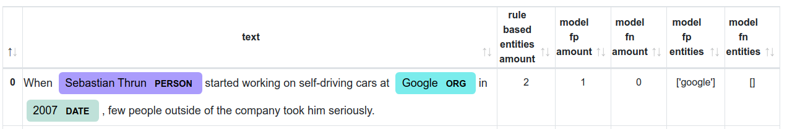
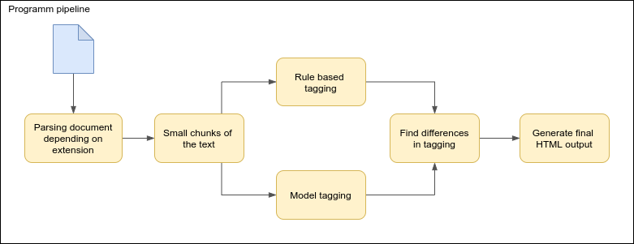

# NER difference visualization
This CLI tool is developed to help find differences between
rule-based automatic tagging and named entity recognition machine learning model. <br>

This tool finds false positive and false negative entities in document assume
that rules are absolute true. 

### Example



In above example described information about small chunk of text
that was processed. 
* text - small chunk of original text that was cut to a big number of these types of chunks
* rule based entities amount - a number of original entities that were found in this chunk of text
* model fp amount - new entities that were tagged by model and were absent in original entities dataset
* model fn amount - entities that were NOT tagged by model, but were existed in original entities dataset
* model fp entities - names of new entities
* model fn entities - names of not tagged entities

From this example we can figure out, that model have tagged new entity - "Google" with "ORG" label and also have tagged
all original entities ("Sebastian Thrun, 2007), because number of fn is zero.

## How it works

Simple scheme roughly describes program logic

## Usage
### Installation
```bash
# clone this repository
git clone https://github.com/AlphaCaprice/NER-difference-visualization
cd NER-difference-visualization

# create virtual environment and install dependencies
# NOTE: programm works stable on python 3.7
python -m venv .env
source .env/bin/activate
pip install -r requirements.txt
```
### Configuration
<b>NOTE:</b> model must be in [Flair](https://github.com/flairNLP/flair) format. <br>
Before launch the application you need to configure <b>settings.ini</b> in which you must
specify paths to models you use and paths to original entities that have such json format:
```json
{
    "Label Name" : [
        "list of entities in lower case", 
        "and sorted by",  
        "length"],
    "Another Label": []
}
```
Also you can specify output directory and colors for [displacy](https://spacy.io/usage/visualizers) visualizer. 
Example of colors json format is in configs folder.

### Launch
Tool has command line interface. Available arguments: <br>
Type `python main.py --help` to get this information.
```buildoutcfg
usage: main.py [-h] [-m MODEL] [-d DEST]
               (--file FILE | --folder FOLDER | --link LINK | --links LINKS)
               language

positional arguments:
  language              two-letter abbreviation of language name (en, fr, zh).

optional arguments:
  -h, --help            show this help message and exit
  -m MODEL, --model MODEL
                        Name of model to use
  -d DEST, --dest DEST  Where to save data
  --file FILE           path to file for processing
  --folder FOLDER       path to folder with valid files for processing
  --link LINK           url to file in the Internet
  --links LINKS         path to txt file that contains links to html files in
                        the Internet; links must be split by new line.
```
Note that you can use only one of the available options per execution:
* --file - process only one file, available extensions: `txt, pdf, docx, doc, html, xml, htm, xht`
* --folder - process all files in given folder
* --link - download and process file from the Internet
* --links - process multiple files from the Internet

Examples <br>
`python main.py --folder /home/user/data/test-data.pdf en` <br>
`python main.py --links links.txt --model model.pt es ` <br>
`python main.py --file fr_file.docx --dest /home/data/fr_output fr ` <br>

Output folder contains 4 output files:
* rule_based_predictions.json - rule based tagged entities in visualizable [displacy format](https://spacy.io/usage/visualizers#manual-usage)
* model_predictions.json - the same output as above but for model tagging
* stat.html - html file with table as in example
* stat.csv - same table but in csv format

